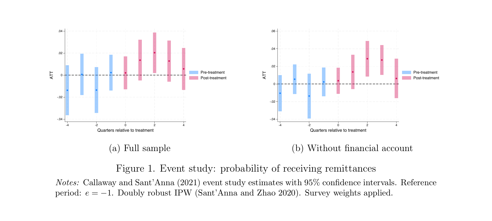

## Agenda

| Bloque | Tema | Min |
|--------|------|-----|
| 1 | La ENAHO por dentro | 15 |
| 2 | De correlación a causalidad | 15 |
| 3 | Caso: agentes bancarios y remesas | 10 |
| 4 | ENAHO + datos administrativos | 10 |
| 5 | Menú de temas de tesis | 5 |
| 6 | Cierre práctico | 5 |

---

# {background-color="#2c3e50"}

::: {style="color: white; font-size: 1.5em; text-align: center;"}
**Bloque 1** — La ENAHO por dentro
:::

---

## ¿Qué es la ENAHO?

- **Encuesta Nacional de Hogares** (INEI), continua desde 2003
- Principal fuente para medir pobreza, empleo y condiciones de vida
- Se ejecuta **todo el año** (enero a diciembre)
- Cobertura: **24 departamentos + Callao**, urbano y rural
- Supervisada por **Comité Asesor de Pobreza** (con Banco Mundial)

---

## Diseño muestral {.smaller}

:::: {.columns}
::: {.column width="50%"}
**Tipo de muestra:**

- Probabilística, de áreas
- **Estratificada** (urbano/rural × depto.)
- **Bietápica**
- Independiente por departamento
- Confianza: 95%
:::
::: {.column width="50%"}
**Muestra 2024:**

- 5,359 conglomerados
- **36,594 viviendas**
- 24,242 urbanas + 12,352 rurales
- Entrevista mixta (presencial + telefónica)
:::
::::

---

## El panel rotativo

- Desde 2008: **muestra panel** donde viviendas se revisitan
- **1/5 de la muestra** se renueva cada año, vida útil: **5 años**
- 2024: 11,840 viviendas panel + 24,780 no panel

| Año | Sub-paneles activos |
|-----|-------------------|
| 2020 | A B C D E |
| 2021 | B C D E **F** |
| 2022 | C D E F **G** |
| 2023 | D E F G **H** |
| 2024 | E F G H **I** |

---

## Niveles de inferencia

No todo se puede desagregar a cualquier nivel:

- **Anual:** Nacional, urbano/rural, 24 departamentos, regiones naturales, Lima Met.
- **Trimestral:** solo nacional y urbano/rural
- **Panel:** nacional, urbano/rural, Costa/Sierra/Selva

**Implicancia para tesis:** No hay representatividad a nivel provincial ni distrital.

---

## Los cuestionarios {.smaller}

| Cuestionario | N | Contenido |
|---|---|---|
| ENAHO.01 | 160 | Vivienda, hogar, miembros, educación |
| ENAHO.01-A | 154 | Salud, empleo e ingresos (14+) |
| ENAHO.01-B | 43 | Gobernabilidad y democracia (18+) |
| ENAHO.02 | 25 | Percepción del hogar |
| ENAHO.04 | 22 | Actividad agropecuaria |
| Gastos | 329 ítems | Alimentos y no alimentarios |

Se organizan en **módulos** (100, 200, 300...) = los archivos que descargan.

---

## Módulos clave {.smaller}

:::: {.columns}
::: {.column width="45%"}
| Módulo | Contenido |
|---|---|
| **100** | Vivienda y hogar |
| **200** | Miembros del hogar |
| **300** | Educación |
| **400** | Salud |
| **500** | Empleo e ingreso |
| **601-612** | Gastos |
| **700** | Gobernabilidad |
| **Sumaria** | Variables calculadas |
:::
::: {.column width="55%"}
**Más usados:** Sumaria, 500, 400

**Sub-explotados:** 700 (corrupción, confianza), discriminación, acceso a justicia

**Tip:** La Sumaria tiene el gasto agregado y la clasificación de pobreza ya calculados por INEI.
:::
::::

---

## ¿Cómo se mide la pobreza monetaria?

:::: {.columns}
::: {.column width="55%"}
**Enfoque del gasto** (no del ingreso):

1. INEI suma el **gasto per cápita mensual**
2. Lo compara con la **línea de pobreza**:
   - Pobreza: gasto < **S/ 454**/persona/mes
   - Extrema: gasto < **S/ 256**/persona/mes
:::
::: {.column width="45%"}
**Cifras 2024:**

| | Tasa |
|---|---|
| Pobreza | **27.6%** (9.4M) |
| Extrema | **5.5%** (1.9M) |
| Urbano | 24.8% |
| Rural | 39.3% |
:::
::::

---

## Disparidades departamentales (2024)

:::: {.columns}
::: {.column width="50%"}
**Mayor pobreza:**

- Cajamarca: **45.0%**
- Loreto: **43.0%**
:::
::: {.column width="50%"}
**Menor pobreza:**

- Ica: **6.0%**
- Moquegua: **11.0%**
- Madre de Dios: **11.1%**
:::
::::

Brecha de **39 pp** entre Cajamarca e Ica. ¿Qué la explica? → pregunta de tesis.

---

## Trampas comunes (1/2)

1. **Sin factores de expansión** → estadísticas sesgadas. Usar `factor07`.
2. **Sin deflactores espaciales** → S/ 454 en Lima ≠ en Huancavelica. Sumaria ya lo tiene.
3. **Mezclar metodologías** → Serie cambió en 2010. No comparar sin empalme.
4. **Inferencia distrital** → ENAHO no tiene representatividad distrital.

---

## Trampas comunes (2/2)

5. **Gasto ≠ ingreso** → INEI mide pobreza por gasto, no ingreso.
6. **Filtrar demasiado** → ~36,000 viviendas. Subgrupos muy específicos pierden poder.
7. **Ignorar diseño muestral** → Muestreo complejo = errores estándar subestimados sin ajuste.

---

## Más allá de pobreza monetaria

:::: {.columns}
::: {.column width="50%"}
**Temas clásicos:**

- Desigualdad (Gini)
- Retornos a la educación
- Brechas salariales
- Informalidad laboral
:::
::: {.column width="50%"}
**Oportunidades de tesis:**

- Discriminación
- Acceso a justicia
- Inclusión financiera
- Programas sociales
- Gobernabilidad y corrupción
- Migración interna
:::
::::

---

## Resumen del Bloque 1

1. ENAHO = encuesta continua, ~36,600 viviendas/año
2. Panel rotativo (1/5 por año, 5 años de vida)
3. Pobreza = gasto vs. línea de pobreza
4. Siempre usar factores de expansión
5. No tiene representatividad distrital
6. Exploren los módulos menos usados

---

# {background-color="#2c3e50"}

::: {style="color: white; font-size: 1.5em; text-align: center;"}
**Bloque 1.5** — Manos a la ENAHO
:::

---

## Replicando la tasa de pobreza oficial {.smaller}

```{python}
#| echo: true
#| eval: false
import pandas as pd, numpy as np
ENAHO = "/Users/jose/Library/CloudStorage/Dropbox/bases/ENAHO/2024"

df = pd.read_stata(f"{ENAHO}/sumaria-2024.dta", convert_categoricals=False)
df.columns = df.columns.str.lower().str.strip()

df["gasto_pc"] = df["gashog2d"] / (df["mieperho"] * 12)
df["pobre"] = (df["gasto_pc"] < df["linea"]).astype(int)
df["factor_pob"] = df["factor07"] * df["mieperho"]

tasa = np.average(df["pobre"], weights=df["factor_pob"]) * 100
print(f"Tasa de pobreza 2024: {tasa:.1f}%")
print(f"(Cifra oficial INEI: 27.6%)")
```

---

## Perfil del pobre {.smaller}

```{python}
#| echo: true
#| eval: false
df["rural"] = (df["estrato"] > 5).astype(int)

for area, nombre in [(0, "Urbano"), (1, "Rural")]:
    sub = df[df["rural"] == area]
    t = np.average(sub["pobre"], weights=sub["factor_pob"]) * 100
    print(f"{nombre}: {t:.1f}%")

print()
for s in [1, 2, 3, 4]:
    sub = df[df["mieperho"] == s]
    t = np.average(sub["pobre"], weights=sub["factor_pob"]) * 100
    print(f"{s} miembros: {t:.1f}%")
sub = df[df["mieperho"] >= 5]
t = np.average(sub["pobre"], weights=sub["factor_pob"]) * 100
print(f"5+ miembros: {t:.1f}%")
```

---

## ¿Qué explica la pobreza? (correlaciones) {.smaller}

```{python}
#| echo: true
#| eval: false
import statsmodels.api as sm

X = sm.add_constant(df[["rural", "mieperho"]])
modelo = sm.WLS(df["pobre"], X, weights=df["factor_pob"]).fit()

print(f"N = {int(modelo.nobs):,}   R² = {modelo.rsquared:.3f}\n")
for v in ["rural", "mieperho"]:
    print(f"  {v:10s}: {modelo.params[v]:+.3f}  (p={modelo.pvalues[v]:.4f})")
```

- Rural → **+15.5 pp** más probable de ser pobre
- Cada miembro adicional → **+6.8 pp**

**Esto NO es causal.** Es el punto de partida para el Bloque 2.

---

## Desigualdad rápida {.smaller}

```{python}
#| echo: true
#| eval: false
from scipy.integrate import trapezoid
from statsmodels.stats.weightstats import DescrStatsW

m = (df["gasto_pc"] > 0) & (df["factor_pob"] > 0)
v = df.loc[m, "gasto_pc"].values
w = df.loc[m, "factor_pob"].values
orden = np.argsort(v)
v, w = v[orden], w[orden]
gini = 1 - 2 * trapezoid(np.cumsum(v*w)/np.sum(v*w), np.cumsum(w)/np.sum(w))
print(f"Gini del gasto per cápita: {gini:.3f}")

stats = DescrStatsW(df.loc[m, "gasto_pc"], weights=df.loc[m, "factor_pob"])
p10, p50, p90 = [stats.quantile(q).iloc[0] for q in [0.1, 0.5, 0.9]]
print(f"P10: S/{p10:.0f}  |  P50: S/{p50:.0f}  |  P90: S/{p90:.0f}")
print(f"Ratio P90/P10: {p90/p10:.1f}x")
```

---

## Lo que acabamos de hacer

1. **Replicamos** la tasa oficial de pobreza (~27.6%)
2. **Perfilamos** al pobre: rural, hogares más grandes
3. **Corrimos regresiones** — pero son correlaciones, no causalidad
4. **Calculamos** Gini (0.35) y ratio P90/P10 (4.9x)

Todo con la Sumaria + `factor07` + Python.

**Pregunta:** ¿Ser rural *causa* pobreza, o los pobres viven en zonas rurales? → Bloque 2.

---

# {background-color="#2c3e50"}

::: {style="color: white; font-size: 1.5em; text-align: center;"}
**Bloque 2** — De correlación a causalidad
:::

---

## El problema central

Quieres estudiar si X afecta la pobreza:

$$\text{Pobreza}_i = \alpha + \beta \cdot X_i + \varepsilon_i$$

**¿$\beta$ es causal?** Casi seguro que no.

- **Variables omitidas** correlacionadas con X y con pobreza
- **Causalidad reversa:** ¿X → pobreza, o pobreza → X?
- **Selección:** los hogares con X son distintos

Necesitas una **estrategia de identificación**.

---

## Estrategias de identificación {.smaller}

| Método | Idea | Necesitas... |
|---|---|---|
| **Diff-in-Diff** | Antes/después, tratados/control | Política con fecha clara |
| **RDD** | Umbral de asignación | Regla con puntaje |
| **IV** | Variable que solo afecta Y vía X | Instrumento exógeno |
| **Panel + FE** | Controlar lo que no cambia | Datos longitudinales |

---

## Diff-in-Diff {.smaller}

$$Y_{it} = \alpha + \beta_1 Post_t + \beta_2 Tratado_i + \delta (Post_t \times Tratado_i) + \varepsilon_{it}$$

:::: {.columns}
::: {.column width="50%"}
$\delta$ = efecto causal (si parallel trends)

**Supuesto:** sin tratamiento, tratados y controles habrían seguido la misma tendencia.
:::
::: {.column width="50%"}
**Ejemplos con ENAHO:**

- Expansión de **Juntos** → pobreza
- **Salario mínimo** → empleo informal
- **Agentes bancarios** → remesas
- **El Niño 2017** → gasto hogares
:::
::::

---

## DiD con adopción escalonada

:::: {.columns}
::: {.column width="50%"}
**Problema del TWFE:**

- "Comparaciones prohibidas"
- Pesos negativos
- Estimaciones sesgadas

(Goodman-Bacon, 2021)
:::
::: {.column width="50%"}
**Soluciones modernas:**

- Callaway & Sant'Anna (2021)
- de Chaisemartin & D'Haultfœuille (2020)
- Sun & Abraham (2021)

Nuevo estándar. TWFE simple ya no es aceptable.
:::
::::

---

## RDD: explotar umbrales

:::: {.columns}
::: {.column width="50%"}
Hogares justo arriba/abajo del umbral son casi idénticos.

$$Y_i = \alpha + \beta T_i + f(X_i - c) + \varepsilon_i$$

Creíble si el puntaje no es manipulable.
:::
::: {.column width="50%"}
**Ejemplos en Perú:**

- **SISFOH:** focalización de Juntos, Pensión 65
- **Quintiles** del mapa de pobreza
- **FONCOMUN:** cortes por población
:::
::::

---

## Variables instrumentales

:::: {.columns}
::: {.column width="50%"}
Variable Z que:

1. Correlacionada con X
2. Solo afecta Y a través de X

La restricción de exclusión es **indemostrable**.
:::
::: {.column width="50%"}
**Ejemplos:**

- Distancia a banco → acceso financiero
- Shocks climáticos → producción agrícola
- Canon minero → gasto público
- Altitud → acceso a mercados
:::
::::

---

## Panel con efectos fijos

$$Y_{it} = \alpha_i + \beta X_{it} + \varepsilon_{it}$$

- $\alpha_i$ absorbe todo lo que **no cambia** en el hogar
- Panel ENAHO: máximo 5 años, con atrición
- No basta solo para causalidad — combinar con DiD o IV

---

## ¿Cómo elegir tu estrategia?

¿Hubo una **política o shock con fecha de inicio**?

- **Sí, de golpe** → DiD clásico
- **Sí, escalonado** → DiD robusto (CS / dCDH)
- **No, pero hay umbral de asignación** → RDD
- **No, pero tengo un instrumento creíble** → IV / 2SLS
- **Nada de lo anterior** → Panel + FE (y argumentar bien)

La estrategia se elige por el **diseño institucional**, no por moda.

---

## Resumen del Bloque 2

1. Correlación ≠ causalidad
2. DiD es la más accesible con ENAHO
3. Tratamiento escalonado → **no usar TWFE simple**
4. Empiecen por la **pregunta**, no por el método
5. Busquen la **variación exógena** en el diseño institucional

---

# {background-color="#2c3e50"}

::: {style="color: white; font-size: 1.5em; text-align: center;"}
**Bloque 3** — Caso: agentes bancarios y remesas
:::

---

## El contexto

Entre 2011-2019, **agentes bancarios** pasaron de cubrir 25% a 85% de distritos.

- Bodega autorizada para servicios financieros básicos
- Llegaron a zonas rurales **sin ningún banco ni cajero**
- 91% de la muestra: única infraestructura financiera

**Pregunta:** ¿Tener un agente cambia las finanzas del hogar?

**¿Por qué remesas?** Primer efecto esperado: poder recibir transferencias. Base: solo 4.6% recibe remesas.

---

## Los datos {.smaller}

:::: {.columns}
::: {.column width="50%"}
**Tratamiento (SBS):**

- Presencia de agentes por distrito × trimestre
- Tratamiento = primer trimestre con ≥1 agente
- 2015Q1 – 2019Q4
:::
::: {.column width="50%"}
**Outcomes (ENAHO):**

- ¿Recibe remesas? ¿Cuánto?
- Individuo × trimestre
- ~49,500 obs, 566 distritos
:::
::::

**Merge** por ubigeo distrital. Un dato da el tratamiento, el otro el outcome.

---

## Estrategia empírica {.smaller}

:::: {.columns}
::: {.column width="50%"}
**Diseño:** DiD escalonado

- 9 cohortes, 20 trimestres
- Control: not-yet-treated
- Estimador: Callaway & Sant'Anna
- Doubly robust IPW
:::
::: {.column width="50%"}
**Validación:**

- Timing exógeno: R² = 0.043, p = 0.103
- Placebos: género, edad, cuenta → todos insignificantes (p > 0.15)
:::
::::

---

## Resultados principales {.smaller}

| Outcome | Estimador | Full | Sin cuenta |
|---|---|---|---|
| **Recibe remesas** | CS | 0.015** | 0.019*** |
| | dCDH | 0.022 | 0.034** |
| | TWFE | −0.000 | −0.001 |
| **Monto (asinh)** | CS | 0.072** | 0.079*** |
| | TWFE | 0.002 | −0.003 |

CS detecta +1.5 pp (+33%). TWFE da cero. **El estimador importa.**

---

## Event study

{fig-align="center" width="80%"}

Pre-trends planos → parallel trends OK. Efectos emergen al 3er trimestre.

---

## Leyendo el event study

:::: {.columns}
::: {.column width="50%"}
- Eje X: trimestres relativos (0 = llega agente)
- **Azul** = pre-tratamiento (deben estar en cero)
- **Rosado** = post-tratamiento
- Barras = IC al 95%
:::
::: {.column width="50%"}
- Si pre-trend ≠ 0 → DiD no creíble
- Panel (b): efectos mayores sin cuenta → consistente con teoría

**Siempre reporten el event study en su tesis.**
:::
::::

---

## ¿Por qué TWFE falla aquí?

- ATT por cohorte: de −0.056 a +0.074 (mucha heterogeneidad)
- TWFE asigna pesos negativos → atenuación
- CS group-weighted: p = 0.009. TWFE: p > 0.90

**Mismos datos. Conclusión opuesta.**

Si el tratamiento es escalonado → **no usar TWFE**.

---

## Lecciones del ejemplo

1. Combinar dato admin (SBS) + encuesta (ENAHO) por ubigeo
2. El rollout escalonado **es** tu experimento natural
3. Validar: exogeneidad del timing + placebos + pre-trends
4. Usar estimadores modernos (CS, dCDH)
5. No necesitan datos propios — datos públicos bastan

---

# {background-color="#2c3e50"}

::: {style="color: white; font-size: 1.5em; text-align: center;"}
**Bloque 4** — ENAHO + datos administrativos
:::

---

## La idea: dos fuentes, una pregunta

:::: {.columns}
::: {.column width="50%"}
**ENAHO te da:**

- Outcomes hogar/persona
- Controles sociodemográficos
- Representatividad nacional
:::
::: {.column width="50%"}
**Datos admin te dan:**

- Tratamiento a nivel distrito
- Cobertura universal
- Sin error de autoreporte
:::
::::

**Merge** por ubigeo distrital.

---

## Fuentes administrativas clave {.smaller}

| Fuente | Contenido | Nivel |
|---|---|---|
| **SIAF** (MEF) | Gasto público municipal | Distrito × mes |
| **SBS** | Oficinas, cajeros, agentes, créditos | Distrito × trim. |
| **RENAMU** (INEI) | Características municipales | Distrito × año |
| **Censo Escolar** (MINEDU) | Matrícula, docentes | IE × año |
| **SENAMHI** | Clima, eventos extremos | Estación × día |
| **SISFOH** (MIDIS) | Clasificación socioeconómica | Hogar |

---

## Ejemplo: SIAF + ENAHO

**SIAF** = todo el gasto público municipal, por distrito y mes.

- Inversión en educación, salud, transporte, saneamiento
- Por fuente: canon, FONCOMUN, recursos propios

**Preguntas de tesis:** agua potable → salud infantil, infraestructura → empleo rural, canon → pobreza local.

*Variación exógena:* fórmula del canon (producción × población).

---

## Ejemplo: SBS + ENAHO

**SBS** = infraestructura financiera por distrito, trimestral desde 2010.

- Oficinas, cajeros, agentes bancarios
- Créditos y depósitos por tipo de institución

**Preguntas de tesis:** inclusión financiera → vulnerabilidad, cierre de oficinas → crédito hogares.

---

## El merge en la práctica {.smaller}

```{python}
#| echo: true
#| eval: false
import pandas as pd

# Cargar ENAHO (nivel individuo)
enaho = pd.read_stata("enaho_2024_500.dta")

# Construir ubigeo distrital (6 dígitos)
enaho["ubigeo"] = (
    enaho["ccdd"].astype(str).str.zfill(2) +
    enaho["ccpp"].astype(str).str.zfill(2) +
    enaho["ccdi"].astype(str).str.zfill(2)
)

# Cargar dato admin y hacer merge
sbs = pd.read_csv("agentes_bancarios_distrito.csv")
df = enaho.merge(sbs, on=["ubigeo", "anio", "trimestre"], how="left")
```

**Cuidado:** el ubigeo cambia cuando se crean nuevos distritos.

---

# {background-color="#2c3e50"}

::: {style="color: white; font-size: 1.5em; text-align: center;"}
**Bloque 5** — Menú de temas de tesis
:::

---

## Ideas concretas (1/2) {.smaller}

| Tema | Método | Variación exógena |
|---|---|---|
| Pensión 65 → pobreza adultos mayores | RDD | Puntaje SISFOH |
| Canon minero → pobreza local | DiD/IV | Fórmula del canon |
| Agua potable → salud infantil | DiD | Proyectos SIAF |
| Migración venezolana → empleo informal | DiD | Shock post-2017 |
| Electrificación rural → trabajo femenino | DiD | Expansión FOSE |

---

## Ideas concretas (2/2) {.smaller}

| Tema | Método | Variación exógena |
|---|---|---|
| El Niño 2017 → resiliencia hogares | DiD | Declaratoria emergencia |
| Internet → empleo juvenil | DiD | Expansión fibra óptica |
| Descentralización fiscal → bienestar | IV | Fórmula FONCOMUN |
| Qali Warma → nutrición | RDD/DiD | Quintil de pobreza |
| Corrupción → confianza institucional | Panel FE | Escándalos municipales |

Todos usan **datos públicos** y son viables como tesis de pregrado.

---

## ¿Cómo elegir tema?

1. **¿Te interesa?** — Vas a vivir con él meses.
2. **¿Los datos existen?** — Descárgalos antes de comprometerte.
3. **¿La variación exógena es creíble?** — Consulta con tu asesor.
4. **¿Alguien ya lo hizo?** — Si sí, ¿puedes mejorar método o datos?
5. **¿Es factible?** — Una tesis no es un paper de AER. Acota bien.

La mejor tesis es la que se termina.

---

# {background-color="#2c3e50"}

::: {style="color: white; font-size: 1.5em; text-align: center;"}
**Bloque 6** — Cierre práctico
:::

---

## ¿Dónde descargar los datos? {.smaller}

| Fuente | URL |
|---|---|
| **ENAHO** | [proyectos.inei.gob.pe/microdatos](https://proyectos.inei.gob.pe/microdatos/) |
| **SIAF** | [apps5.mineco.gob.pe/transparencia](https://apps5.mineco.gob.pe/transparencia/mensual/) |
| **SBS** | [sbs.gob.pe/estadisticas](https://www.sbs.gob.pe/estadisticas-y-publicaciones/estadisticas-) |
| **RENAMU** | [proyectos.inei.gob.pe/microdatos](https://proyectos.inei.gob.pe/microdatos/) |
| **ESCALE** | [escale.minedu.gob.pe](https://escale.minedu.gob.pe/) |
| **SENAMHI** | [senamhi.gob.pe](https://www.senamhi.gob.pe/?&p=estaciones) |

En Python: `pd.read_stata()` o `pd.read_spss()`

---

## Herramientas en Python {.smaller}

```{python}
#| echo: true
#| eval: false
import pandas as pd
from statsmodels.stats.weightstats import DescrStatsW

# Media ponderada del gasto per cápita
sumaria = pd.read_stata("sumaria-2024.dta")
stats = DescrStatsW(sumaria["gpcm"], weights=sumaria["factor07"])
print(f"Gasto promedio: S/ {stats.mean:.1f}")
print(f"IC 95%: [{stats.tconfint_mean()[0]:.1f}, {stats.tconfint_mean()[1]:.1f}]")
```

Para DiD robusto: **R** (`did`) y **Stata** (`csdid`) están más maduros que Python.

---

## Flujo de trabajo sugerido

1. **Pregunta** de investigación
2. **Identificar** datos y variación exógena
3. **Descargar** y limpiar
4. **Descriptivas** → entender los datos
5. **Estrategia** de identificación
6. **Estimación** + robustez
7. **Escribir** la tesis

**No empiecen por el paso 3.** Primero la pregunta y la estrategia.

---

## Recursos

- Angrist & Pischke — *Mostly Harmless Econometrics*
- Cunningham — *Causal Inference: The Mixtape* (gratuito online)
- Huntington-Klein — *The Effect* (gratuito online)
- Callaway & Sant'Anna (2021), *J. of Econometrics*
- Goodman-Bacon (2021), *J. of Econometrics*

---

## {background-color="#2c3e50"}

::: {style="color: white; text-align: center;"}

[**Gracias**]{style="font-size: 1.8em;"}

Slides y código: [github.com/joseantonioLVL/charla-enaho-pobreza-uni](https://github.com/joseantonioLVL/charla-enaho-pobreza-uni)

[¿Preguntas?]{style="font-size: 1.3em;"}
:::
